# VibeCoding 系统设计文档 v4.0

## 目录

1. [系统概述](#系统概述)
2. [架构设计](#架构设计)
3. [核心模块](#核心模块)
4. [数据模型](#数据模型)
5. [AI 集成架构](#ai-集成架构)
6. [场景造句功能设计](#场景造句功能设计)
7. [文档管理流程](#文档管理流程)
8. [前端组件架构](#前端组件架构)
9. [API 设计](#api-设计)
10. [技术栈](#技术栈)

---

## 系统概述

VibeCoding 是一个智能英语学习平台，通过 AI 驱动的文档解析、翻译对齐、场景造句和练习生成，帮助用户高效学习英语。

### 核心特性

- **智能文档处理**：支持 PDF、Word、图片上传，自动 OCR 识别、翻译对齐
- **场景造句**：基于生词和场景，AI 生成高频搭配，引导用户逐步构建地道句子
- **智能练习**：自动生成多种题型（选词填空、句子拼装、单词匹配）
- **生词本管理**：集成 SRS 算法，支持单词复习和进度跟踪
- **增量内容追加**：支持向已有文档追加文本或图片，智能去重和合并

---

## 架构设计

### 系统架构图

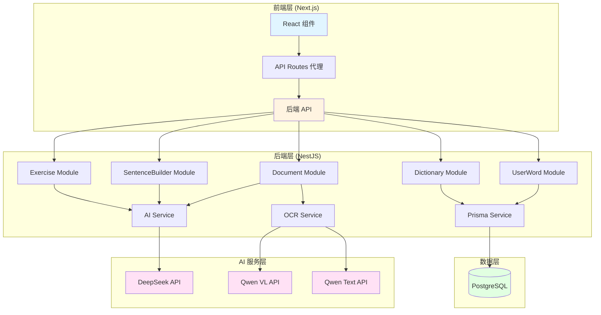

### 模块依赖关系

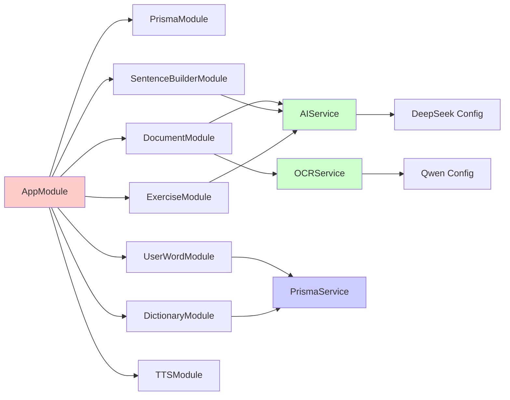

---

## 核心模块

### 1. Document Module（文档管理）

**职责**：
- 文档上传和解析（PDF、Word、纯文本）
- 图片 OCR 识别和结构化提取
- 中英文翻译对齐
- 增量内容追加（文本/图片）
- 文档内容查询

**关键方法**：
- `parseAndSaveDocument()`: 解析并保存文档
- `parseAndSaveImages()`: OCR 识别图片并保存
- `appendText()`: 追加文本内容
- `appendImages()`: 追加图片内容
- `translateAlignRebuild()`: 翻译对齐并重建结构

### 2. SentenceBuilder Module（场景造句）

**职责**：
- 基于场景和生词生成词库（高频搭配）
- 实时推荐下一个词块（next-token）
- 句子评估和反馈
- 保存用户构建的句子

**关键方法**：
- `generateSceneLexicon()`: 生成场景词库
- `suggestNextTokens()`: 推荐下一个词块
- `evaluateSentence()`: 评估句子质量
- `saveSentence()`: 保存句子到数据库

### 3. OCR Service（图像识别）

**职责**：
- 图片文字识别（使用 Qwen VL）
- 结构化提取（句子对、单词对）
- 内容合并和去重

**关键方法**：
- `imageToTextStructured()`: 结构化 OCR 识别
- `mergeAndStructureContent()`: 合并原有和新增内容

### 4. AI Service（AI 服务）

**职责**：
- 文本翻译（DeepSeek）
- 句子对齐（DeepSeek）
- 题目生成（DeepSeek）
- 文本合并去重（Qwen）

**关键方法**：
- `extractAlignedSentencePairsFromEnglishArticle()`: 提取对齐的句子对
- `generateAdvancedQuestions()`: 生成高级题目
- `mergeAndDeduplicate()`: 合并去重文本

---

## 数据模型

### 核心实体关系图

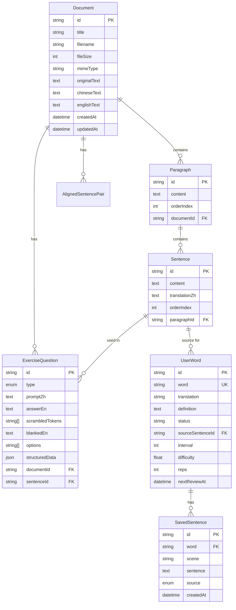

### 数据模型说明

#### Document（文档）
- `originalText`: 千问 OCR 返回的原始文本（包含音标、注释等）
- `chineseText`: 纯中文的句子和单词（按行分隔，一一对应）
- `englishText`: 纯英文的句子和单词（按行分隔，一一对应）

#### SavedSentence（已保存句子）
- `word`: 关联的生词（外键到 UserWord.word）
- `scene`: 场景名称
- `sentence`: 保存的句子内容
- `source`: 来源（USER/SUGGESTED/EVAL）
- 唯一约束：`(word, scene, sentence)`

#### ExerciseQuestion（练习题目）
- `type`: 题目类型（SCRAMBLE/CHOICE/SENTENCE_COMPLETION/WORD_MATCHING）
- `structuredData`: JSON 格式存储复杂题目结构
- `scrambledTokens`: 句子拼装题的词块数组
- `blankedEn`: 选词填空题的带空格的句子模板

---

## AI 集成架构

### AI 服务调用流程

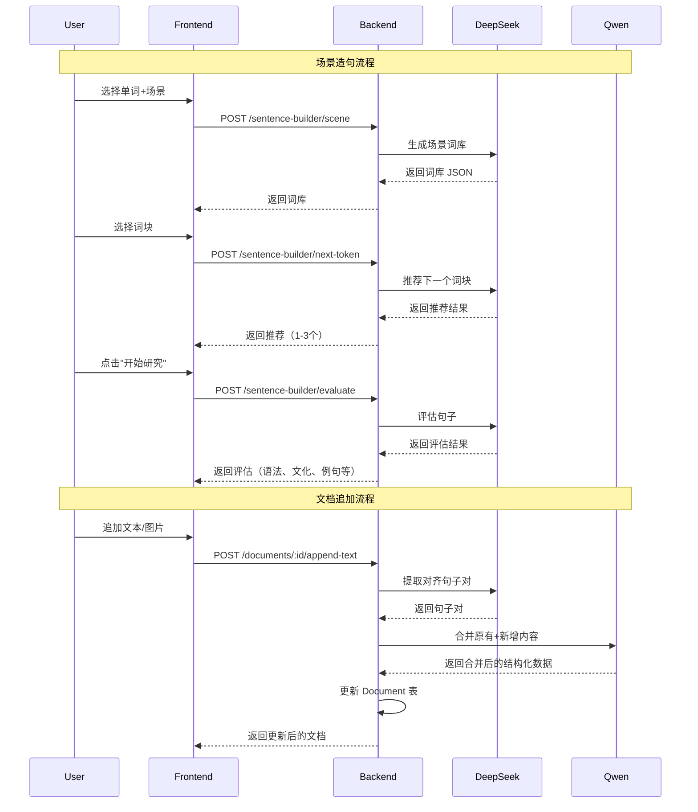

### Prompt 工程策略

#### 1. 场景词库生成（DeepSeek）

**输入**：
- 场景名称
- 目标单词（可选）
- 用户水平（A2/B1/B2 等）

**输出结构**：
```json
{
  "scene": "机场值机",
  "requiredWord": "luggage",
  "corePhrases": [
    { "id": "core_1", "text": "check in my luggage" }
  ],
  "subjects": [
    { "id": "subj_1", "text": "I" }
  ],
  "verbs": [
    { "id": "verb_1", "text": "would like to" }
  ],
  "objects": [
    { "id": "obj_1", "text": "my luggage" }
  ],
  "modifiers": [
    { "id": "mod_1", "text": "at the counter" }
  ],
  "suggestedSentences": [
    "I would like to check in my luggage."
  ]
}
```

**关键约束**：
- 如果提供了 `requiredWord`，`corePhrases` 必须全部包含该词
- 所有词块必须与场景紧密相关
- 输出严格 JSON 格式

#### 2. Next-Token 推荐（DeepSeek）

**输入**：
- 当前已选词块（结构化：`[{category, id, text}]`）
- 所有可选词块
- 场景名称

**输出结构**：
```json
{
  "nextCategory": "subjects | verbs | objects | modifiers | done",
  "recommendedIds": ["subj_1", "subj_2"],
  "recommendations": [
    { "id": "subj_1", "reasonZh": "常用主语搭配" }
  ]
}
```

**推荐逻辑**：
1. 如果存在 `requiredWord` 且未选核心搭配，优先推荐 `corePhrases`
2. 如果核心搭配已选，按顺序推荐：subjects -> verbs -> modifiers
3. 如果句子完整，返回 `nextCategory: "done"`

#### 3. 句子评估（DeepSeek）

**输入**：
- 场景
- 目标单词（可选）
- 用户构建的句子
- 用户水平

**输出结构**：
```json
{
  "sentence": "I would like to check in my luggage.",
  "isGrammaticallyCorrect": true,
  "isNatural": true,
  "corrections": [
    {
      "original": "want to",
      "suggested": "would like to",
      "reasonZh": "更礼貌的表达"
    }
  ],
  "explanations": {
    "grammarPoints": [
      { "title": "would like to", "detailZh": "表示礼貌的请求" }
    ],
    "cultureTips": [
      "在机场场景中，用 'would like to' 比 'want to' 更礼貌。"
    ],
    "pronunciation": {
      "ipa": "...",
      "linkingTipsZh": "标出可能的连读、弱读等。"
    }
  },
  "suggestedExamples": [
    "I would like to check in two bags.",
    "I need to change my flight for tomorrow morning."
  ]
}
```

#### 4. OCR 结构化提取（Qwen VL）

**输入**：
- 图片（base64）

**输出结构**：
```json
{
  "originalText": "提取的所有文本（保持原文格式）",
  "sentencePairs": [
    { "en": "纯英文句子", "zh": "纯中文翻译" }
  ],
  "wordPairs": [
    { "en": "英文单词", "zh": "中文对照" }
  ]
}
```

**验证规则**：
- `en` 字段严禁包含中文、音标、词性标注
- `zh` 字段严禁包含英文
- 如果验证失败，自动重试一次

#### 5. 内容合并（Qwen Text）

**输入**：
- 原有 `originalText`, `chineseText`, `englishText`
- 新增 OCR 结果数组

**输出结构**：
```json
{
  "originalText": "合并后的完整原文（去除重复）",
  "sentencePairs": [
    { "en": "完整的英文句子", "zh": "对应的中文句子" }
  ],
  "wordPairs": [
    { "en": "英文单词", "zh": "中文对照" }
  ]
}
```

**合并策略**：
1. 识别并去除重复的句子和单词
2. 保持逻辑顺序
3. 区分句子（长度>15 且包含空格）和单词（长度≤15 或不包含空格）

---

## 场景造句功能设计

### 功能流程图

```mermaid
flowchart TD
    A[用户选择单词+场景] --> B[生成场景词库]
    B --> C{是否有目标单词?}
    C -->|是| D[显示高频搭配区]
    C -->|否| E[显示主语选择区]
    D --> F[用户选择核心短语]
    F --> G[AI 推荐下一个词块]
    G --> H[用户选择主语]
    H --> I[AI 推荐下一个词块]
    I --> J[用户选择动词]
    J --> K[AI 推荐下一个词块]
    K --> L[用户选择修饰语]
    L --> M[句子构建完成]
    M --> N[用户点击"开始研究"]
    N --> O[AI 评估句子]
    O --> P[显示评估结果]
    P --> Q[用户保存句子]
    Q --> R[保存到数据库]
    
    style D fill:#ffe1f5
    style G fill:#e1f5ff
    style I fill:#e1f5ff
    style K fill:#e1f5ff
    style O fill:#ffe1f5
```

### 前端组件结构

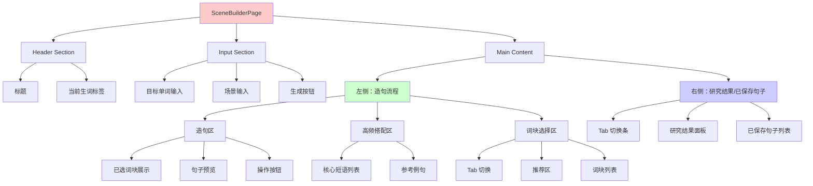

### 状态管理

```typescript
// 核心状态
- scene: string                    // 当前场景
- word: string                     // 目标单词
- lexicon: SceneLexicon | null     // 场景词库
- selected: Selected               // 已选词块
- activeTab: 'subjects' | 'verbs' | 'objects' | 'modifiers'
- nextSuggestion: NextSuggestion   // AI 推荐结果
- evaluation: Evaluation | null     // 评估结果
- savedSentences: SavedSentence[]  // 已保存句子
- rightTab: 'analysis' | 'saved'   // 右侧 Tab
```

### 交互逻辑

#### 1. 词块选择流程

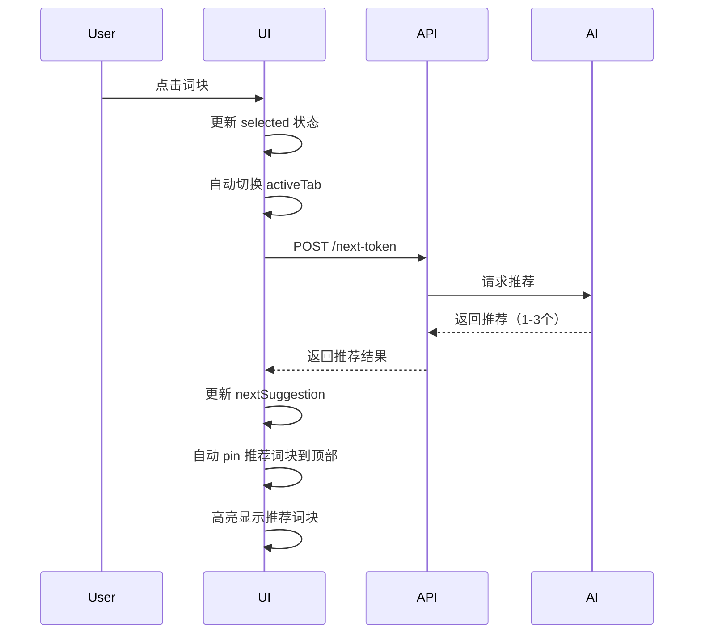

#### 2. 推荐词块展示

- **推荐区**：在词块选择区顶部显示 1-3 个推荐词块，带推荐理由
- **Pin 机制**：推荐词块自动置顶，用黄色边框高亮
- **理由显示**：鼠标悬停或内联显示推荐理由（中文，≤12 字）

#### 3. 句子评估流程

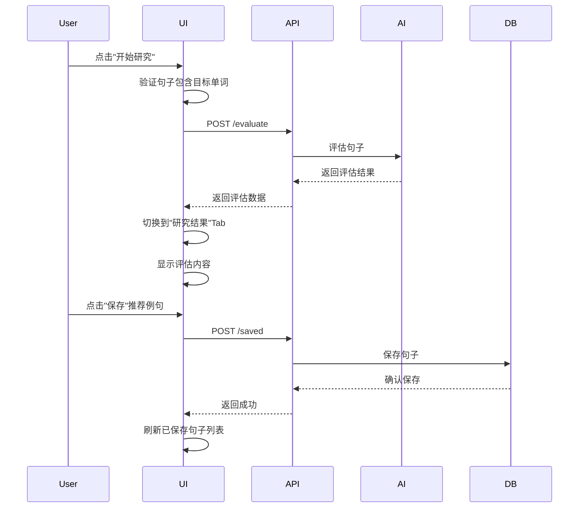

---

## 文档管理流程

### 文档上传和解析流程

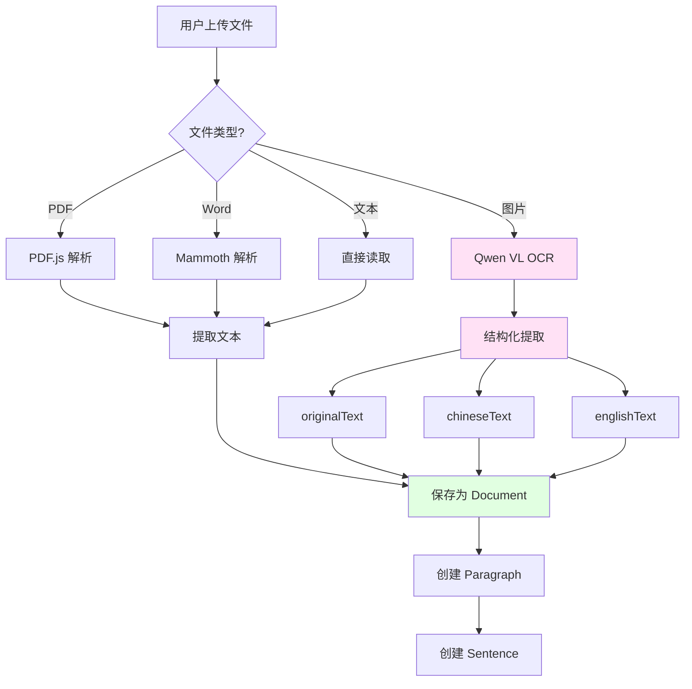

### 增量内容追加流程

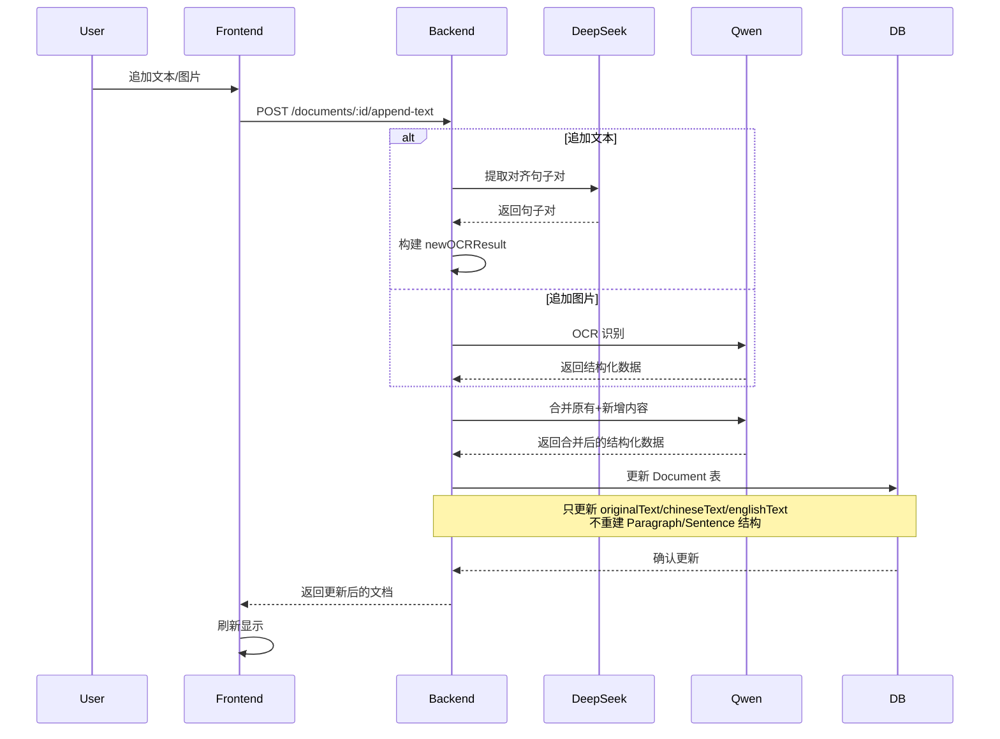

### 题目生成流程

```mermaid
flowchart TD
    A[用户点击"生成题目"] --> B[读取 Document.chineseText/englishText]
    B --> C[按行解析，区分句子和单词]
    C --> D{是否已有题目?}
    D -->|是| E[跳过]
    D -->|否| F[调用 AI 生成题目]
    F --> G[生成选词填空]
    F --> H[生成句子拼装]
    F --> I[生成单词匹配]
    G --> J[保存到 ExerciseQuestion]
    H --> J
    I --> J
    J --> K[返回生成数量]
    
    style F fill:#ffe1f5
    style J fill:#e1ffe1
```

---

## 前端组件架构

### 页面路由结构

```
/app
  /documents
    /[id]
      page.tsx          # 文档详情页（阅读、练习）
  /scene-builder
    page.tsx            # 场景造句工作台
  /user-words
    page.tsx            # 生词本
  /api
    /sentence-builder
      /[...path]
        route.ts        # API 代理路由
```

### 核心组件层次

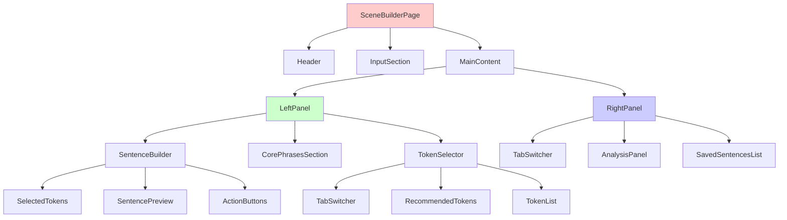

### 关键 Hook 使用

```typescript
// useSearchParams: 从 URL 获取 word 参数
const searchParams = useSearchParams();
const word = searchParams?.get('word') ?? '';

// useMemo: 计算句子、推荐词块等
const sentence = useMemo(() => buildSentence(selected), [selected]);
const pinnedCurrentTokens = useMemo(() => {
  // 自动 pin 推荐词块到顶部
}, [lexicon, activeTab, recommendedIdSet]);

// useEffect: 自动调用 next-token API
useEffect(() => {
  // 当 selected 变化时，自动请求推荐
}, [orderedSelectedTokens]);
```

---

## API 设计

### Sentence Builder API

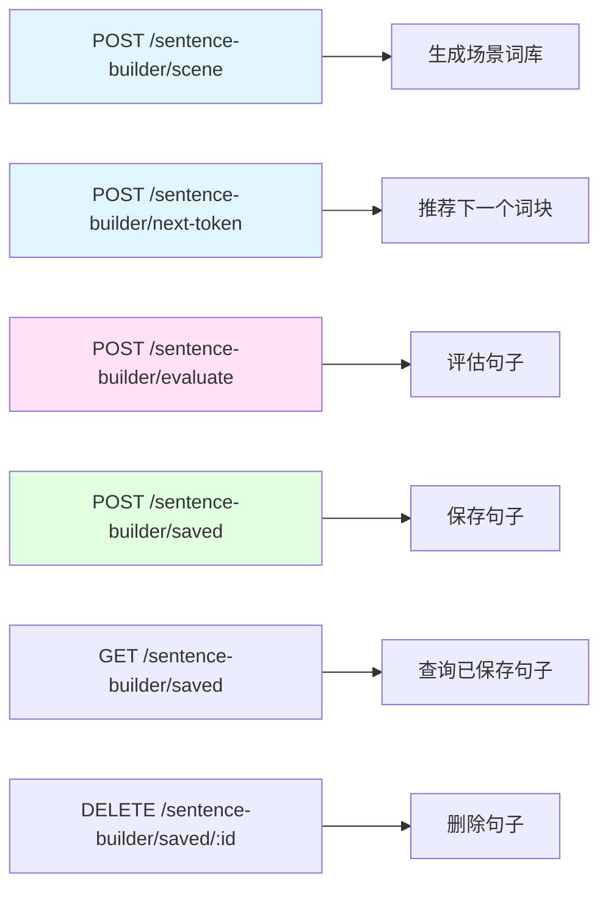

### Document API

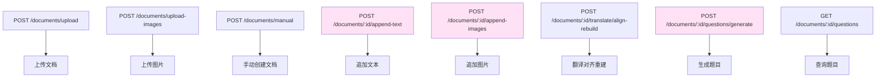

### API 代理机制

前端通过 Next.js API Routes 代理后端请求：

```typescript
// frontend/src/app/api/sentence-builder/[...path]/route.ts
// 动态路由，支持所有 sentence-builder 子路径
export async function POST(req: NextRequest) {
  const suffix = getSuffixFromPathname(new URL(req.url).pathname);
  // 转发到 backend:3001/sentence-builder/${suffix}
}
```

---

## 技术栈

### 前端

- **框架**: Next.js 14 (App Router)
- **UI 库**: React 18, Tailwind CSS
- **状态管理**: React Hooks (useState, useEffect, useMemo)
- **类型系统**: TypeScript
- **HTTP 客户端**: Fetch API

### 后端

- **框架**: NestJS
- **ORM**: Prisma
- **数据库**: PostgreSQL
- **文件处理**: 
  - PDF.js (PDF 解析)
  - Mammoth (Word 解析)
- **HTTP 客户端**: Axios

### AI 服务

- **DeepSeek**: 
  - 文本生成/翻译
  - 句子对齐
  - 题目生成
  - 句子评估
- **Qwen**:
  - Qwen VL (图片 OCR)
  - Qwen Text (文本合并去重)

### 开发工具

- **包管理**: npm
- **代码规范**: ESLint
- **构建工具**: TypeScript Compiler, Next.js Build

---

## 关键设计决策

### 1. 增量内容追加策略

**问题**：如何在不破坏现有结构的情况下追加内容？

**解决方案**：
- 不重建 `Paragraph`/`Sentence` 结构
- 只更新 `Document` 表的 `originalText`/`chineseText`/`englishText`
- 使用 Qwen 智能合并，自动去重
- 题目生成时基于 `chineseText`/`englishText` 按行解析

**优势**：
- 保持现有学习进度
- 避免数据丢失
- 智能去重，避免重复内容

### 2. 场景造句的引导式设计

**问题**：如何引导用户逐步构建地道句子？

**解决方案**：
- 分步骤引导：核心短语 → 主语 → 动词 → 修饰语
- AI 实时推荐下一个词块（1-3 个）
- 推荐词块自动置顶并高亮
- 显示推荐理由（中文，≤12 字）

**优势**：
- 降低学习难度
- 提高句子质量
- 增强用户参与感

### 3. 结构化数据输出

**问题**：如何确保 AI 输出可解析的结构化数据？

**解决方案**：
- 使用 `response_format: { type: 'json_object' }`
- 严格的 Prompt 约束
- JSON 提取和验证逻辑
- 失败时自动重试

**优势**：
- 提高解析成功率
- 减少错误处理成本
- 保证数据一致性

### 4. 前端-后端通信架构

**问题**：如何避免 CORS 问题并简化 API 调用？

**解决方案**：
- Next.js API Routes 作为代理
- 动态路由支持所有子路径
- 统一的错误处理

**优势**：
- 避免 CORS 配置
- 统一的前端 API 接口
- 便于未来迁移到微服务

---

## 未来扩展方向

### 1. 缓存优化
- Redis 缓存场景词库
- 缓存 AI 评估结果
- 减少重复 API 调用

### 2. 用户系统
- 多用户支持
- 学习进度跟踪
- 个性化推荐

### 3. 更多练习类型
- 听力练习
- 口语练习
- 写作练习

### 4. 数据分析
- 学习报告
- 单词掌握度分析
- 场景使用统计

---

## 总结

VibeCoding 系统通过 AI 驱动的文档处理、场景造句和智能练习，为英语学习者提供了一个高效、个性化的学习平台。核心设计理念是：

1. **AI 优先**：充分利用大模型能力，减少人工标注成本
2. **增量更新**：支持内容追加，不破坏现有学习进度
3. **引导式学习**：通过分步骤引导和实时推荐，降低学习难度
4. **结构化数据**：严格的数据格式约束，确保系统稳定性

系统架构清晰，模块职责明确，易于扩展和维护。

