# 融合游戏化填空与自然对话的语言学习系统 - 详细设计文档 v0.6

## 文档概述

本文档基于 `0005-new-design.md` 的理论研究，结合当前系统的实际实现，提供完整的技术架构设计、模块实现方案和部署策略。文档使用 Mermaid 图表进行可视化说明，确保设计思路清晰可执行。

---

## 一、系统架构总览

### 1.1 整体架构图

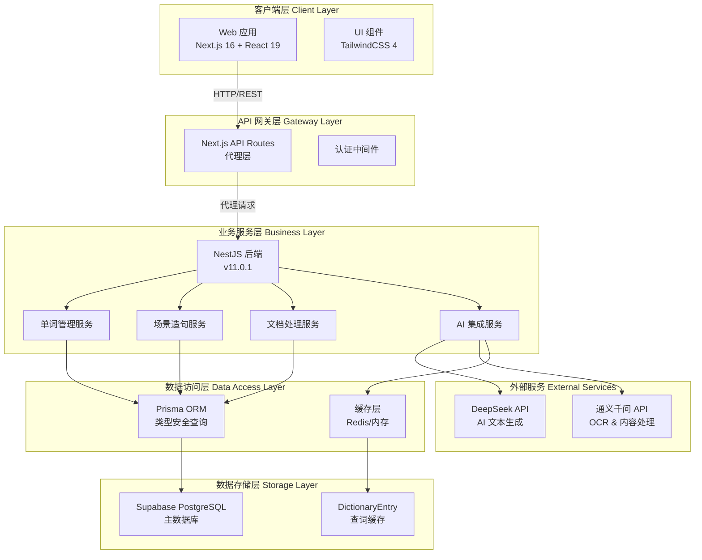
```mermaid
graph TB
    subgraph "客户端层 Client Layer"
        WebApp["Web 应用<br/>Next.js 16 + React 19"]
        UI["UI 组件<br/>TailwindCSS 4"]
    end
    
    subgraph "API 网关层 Gateway Layer"
        NextAPI["Next.js API Routes<br/>代理层"]
        Auth["认证中间件"]
    end
    
    subgraph "业务服务层 Business Layer"
        NestJS["NestJS 后端<br/>v11.0.1"]
        WordService["单词管理服务"]
        SceneService["场景造句服务"]
        DocService["文档处理服务"]
        AIService["AI 集成服务"]
    end
    
    subgraph "数据访问层 Data Access Layer"
        Prisma["Prisma ORM<br/>类型安全查询"]
        Cache["缓存层<br/>Redis/内存"]
    end
    
    subgraph "数据存储层 Storage Layer"
        Supabase["Supabase PostgreSQL<br/>主数据库"]
        Dictionary["DictionaryEntry<br/>查词缓存"]
    end
    
    subgraph "外部服务 External Services"
        DeepSeek["DeepSeek API<br/>AI 文本生成"]
        Qwen["通义千问 API<br/>OCR & 内容处理"]
    end
    
    WebApp -->|HTTP/REST| NextAPI
    NextAPI -->|代理请求| NestJS
    NestJS --> WordService
    NestJS --> SceneService
    NestJS --> DocService
    NestJS --> AIService
    
    WordService --> Prisma
    SceneService --> Prisma
    DocService --> Prisma
    AIService --> DeepSeek
    AIService --> Qwen
    
    Prisma --> Supabase
    AIService --> Cache
    Cache --> Dictionary
```

### 1.2 技术栈详情

| 层级 | 技术 | 版本 | 用途 |
|------|------|------|------|
| **前端框架** | Next.js | 16.1.6 | SSR/SSG 混合渲染 |
| **UI 框架** | React | 19.2.3 | 组件化开发 |
| **样式方案** | TailwindCSS | 4.x | 原子化 CSS |
| **后端框架** | NestJS | 11.0.1 | 企业级 Node.js 框架 |
| **ORM** | Prisma | 最新 | 类型安全数据库访问 |
| **数据库** | PostgreSQL | (Supabase) | 关系型数据库 |
| **AI 服务** | DeepSeek API | - | 智能文本生成与理解 |
| **OCR 服务** | 通义千问 | - | 图像文字识别 |
| **部署平台** | Vercel | - | 前端部署 |
| **部署平台** | Railway | - | 后端部署 |

---

## 二、核心功能模块设计

### 2.1 三阶段漏斗模型架构

基于 `0005-new-design.md` 中提出的三阶段漏斗模型，系统实现如下：

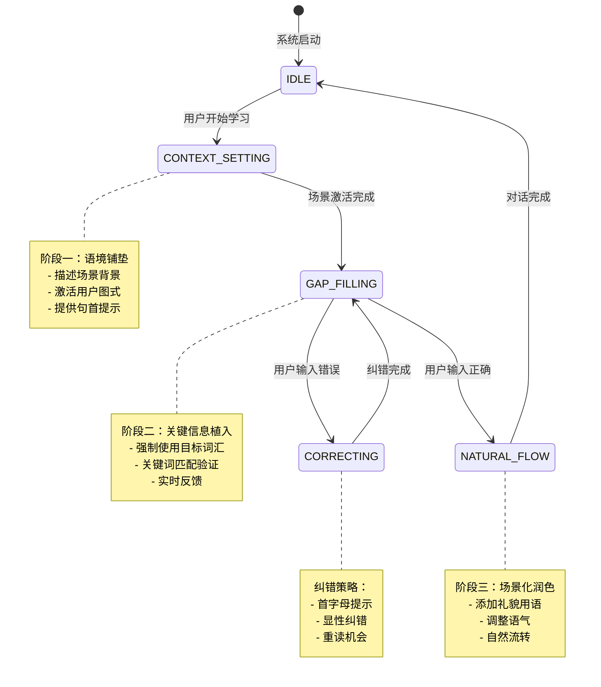
```mermaid
stateDiagram-v2
    [*] --> IDLE: 系统启动
    
    IDLE --> CONTEXT_SETTING: 用户开始学习
    
    CONTEXT_SETTING --> GAP_FILLING: 场景激活完成
    note right of CONTEXT_SETTING
        阶段一：语境铺垫
        - 描述场景背景
        - 激活用户图式
        - 提供句首提示
    end note
    
    GAP_FILLING --> CORRECTING: 用户输入错误
    GAP_FILLING --> NATURAL_FLOW: 用户输入正确
    note right of GAP_FILLING
        阶段二：关键信息植入
        - 强制使用目标词汇
        - 关键词匹配验证
        - 实时反馈
    end note
    
    CORRECTING --> GAP_FILLING: 纠错完成
    note right of CORRECTING
        纠错策略：
        - 首字母提示
        - 显性纠错
        - 重读机会
    end note
    
    NATURAL_FLOW --> IDLE: 对话完成
    note right of NATURAL_FLOW
        阶段三：场景化润色
        - 添加礼貌用语
        - 调整语气
        - 自然流转
    end note
```

### 2.2 单词管理模块

#### 2.2.1 数据模型

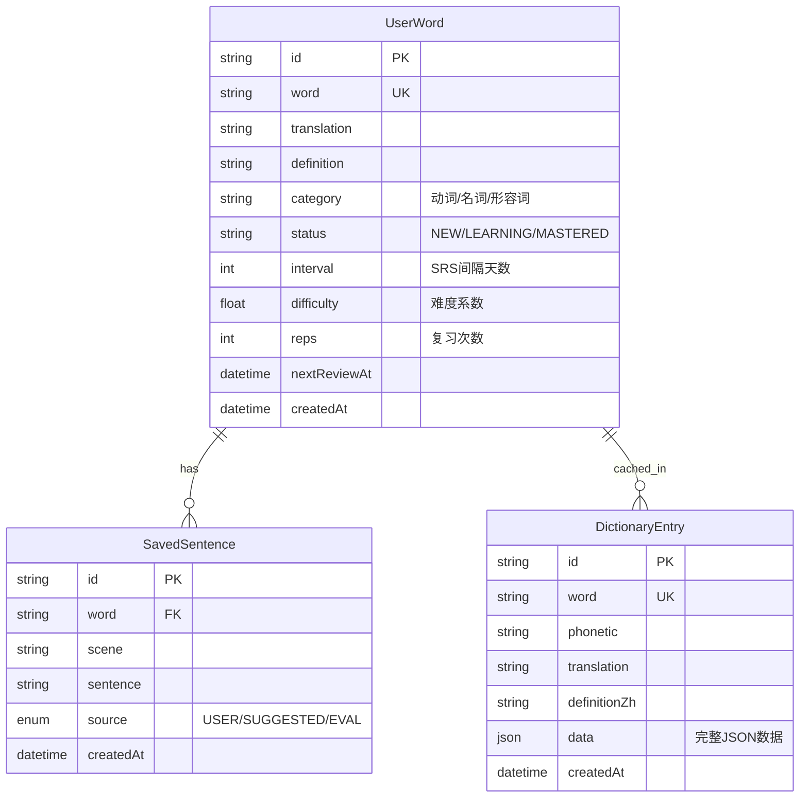
```mermaid
erDiagram
    UserWord ||--o{ SavedSentence : has
    UserWord ||--o{ DictionaryEntry : cached_in
    
    UserWord {
        string id PK
        string word UK
        string translation
        string definition
        string category "动词/名词/形容词"
        string status "NEW/LEARNING/MASTERED"
        int interval "SRS间隔天数"
        float difficulty "难度系数"
        int reps "复习次数"
        datetime nextReviewAt
        datetime createdAt
    }
    
    SavedSentence {
        string id PK
        string word FK
        string scene
        string sentence
        enum source "USER/SUGGESTED/EVAL"
        datetime createdAt
    }
    
    DictionaryEntry {
        string id PK
        string word UK
        string phonetic
        string translation
        string definitionZh
        json data "完整JSON数据"
        datetime createdAt
    }
```

#### 2.2.2 单词查询流程

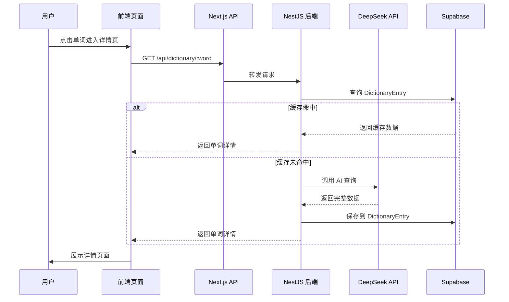
```mermaid
sequenceDiagram
    participant User as 用户
    participant Frontend as 前端页面
    participant API as Next.js API
    participant Backend as NestJS 后端
    participant DeepSeek as DeepSeek API
    participant DB as Supabase
    
    User->>Frontend: 点击单词进入详情页
    Frontend->>API: GET /api/dictionary/:word
    API->>Backend: 转发请求
    
    Backend->>DB: 查询 DictionaryEntry
    alt 缓存命中
        DB-->>Backend: 返回缓存数据
        Backend-->>Frontend: 返回单词详情
    else 缓存未命中
        Backend->>DeepSeek: 调用 AI 查询
        DeepSeek-->>Backend: 返回完整数据
        Backend->>DB: 保存到 DictionaryEntry
        Backend-->>Frontend: 返回单词详情
    end
    
    Frontend->>User: 展示详情页面
```

### 2.3 场景造句模块

#### 2.3.1 场景造句架构

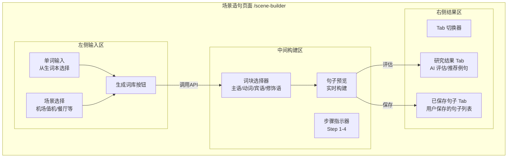
```mermaid
graph TB
    subgraph "场景造句页面 /scene-builder"
        subgraph "左侧输入区"
            WordInput["单词输入<br/>从生词本选择"]
            SceneInput["场景选择<br/>机场值机/餐厅等"]
            GenerateBtn["生成词库按钮"]
        end
        
        subgraph "中间构建区"
            StepIndicator["步骤指示器<br/>Step 1-4"]
            TokenSelector["词块选择器<br/>主语/动词/宾语/修饰语"]
            SentencePreview["句子预览<br/>实时构建"]
        end
        
        subgraph "右侧结果区"
            TabSwitch["Tab 切换器"]
            AnalysisTab["研究结果 Tab<br/>AI 评估/推荐例句"]
            SavedTab["已保存句子 Tab<br/>用户保存的句子列表"]
        end
    end
    
    WordInput --> GenerateBtn
    SceneInput --> GenerateBtn
    GenerateBtn -->|调用API| TokenSelector
    TokenSelector --> SentencePreview
    SentencePreview -->|评估| AnalysisTab
    SentencePreview -->|保存| SavedTab
```

#### 2.3.2 场景造句数据流

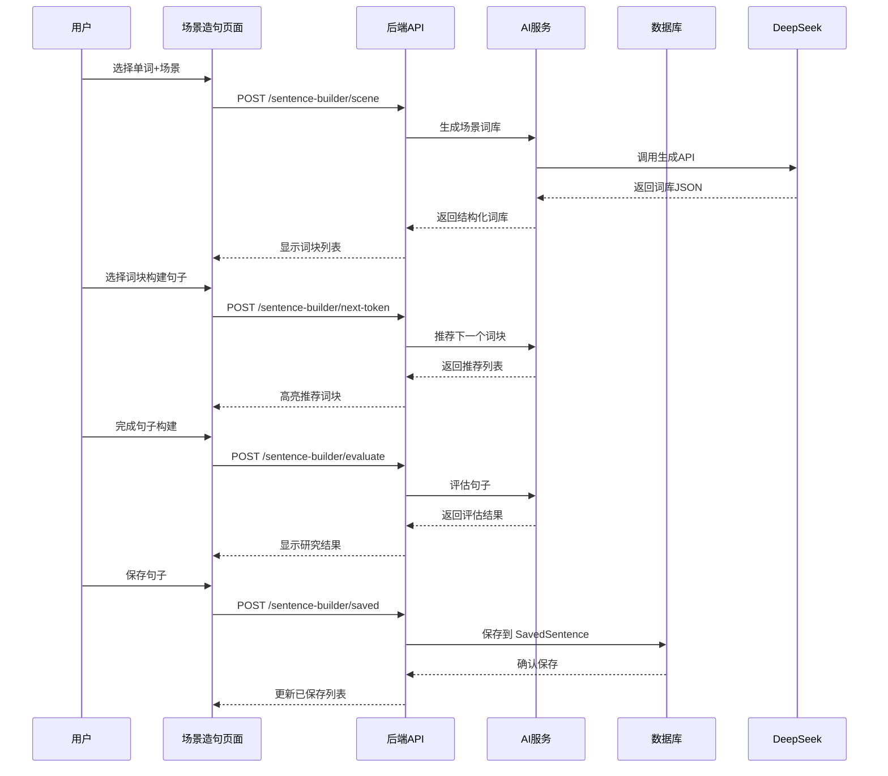
```mermaid
sequenceDiagram
    participant User as 用户
    participant SceneBuilder as 场景造句页面
    participant API as 后端API
    participant AIService as AI服务
    participant DB as 数据库
    
    User->>SceneBuilder: 选择单词+场景
    SceneBuilder->>API: POST /sentence-builder/scene
    API->>AIService: 生成场景词库
    AIService->>DeepSeek: 调用生成API
    DeepSeek-->>AIService: 返回词库JSON
    AIService-->>API: 返回结构化词库
    API-->>SceneBuilder: 显示词块列表
    
    User->>SceneBuilder: 选择词块构建句子
    SceneBuilder->>API: POST /sentence-builder/next-token
    API->>AIService: 推荐下一个词块
    AIService-->>API: 返回推荐列表
    API-->>SceneBuilder: 高亮推荐词块
    
    User->>SceneBuilder: 完成句子构建
    SceneBuilder->>API: POST /sentence-builder/evaluate
    API->>AIService: 评估句子
    AIService-->>API: 返回评估结果
    API-->>SceneBuilder: 显示研究结果
    
    User->>SceneBuilder: 保存句子
    SceneBuilder->>API: POST /sentence-builder/saved
    API->>DB: 保存到 SavedSentence
    DB-->>API: 确认保存
    API-->>SceneBuilder: 更新已保存列表
```

### 2.4 间隔重复系统 (SRS)

#### 2.4.1 SRS 算法流程

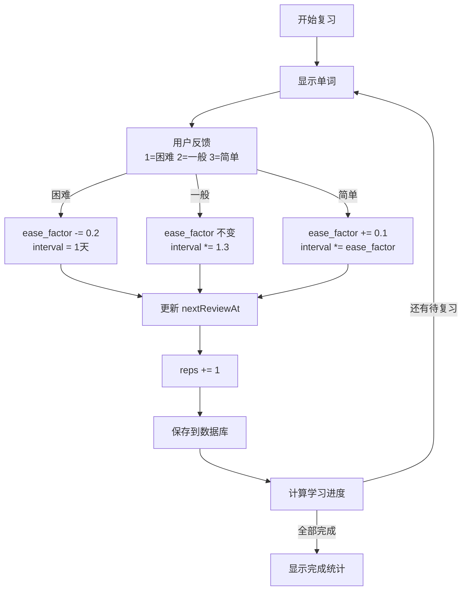
```mermaid
flowchart TD
    A["开始复习"] --> B["显示单词"]
    B --> C["用户反馈<br/>1=困难 2=一般 3=简单"]
    
    C -->|困难| D1["ease_factor -= 0.2<br/>interval = 1天"]
    C -->|一般| D2["ease_factor 不变<br/>interval *= 1.3"]
    C -->|简单| D3["ease_factor += 0.1<br/>interval *= ease_factor"]
    
    D1 --> E["更新 nextReviewAt"]
    D2 --> E
    D3 --> E
    
    E --> F["reps += 1"]
    F --> G["保存到数据库"]
    G --> H["计算学习进度"]
    
    H -->|还有待复习| B
    H -->|全部完成| I["显示完成统计"]
```

#### 2.4.2 SRS 数据模型

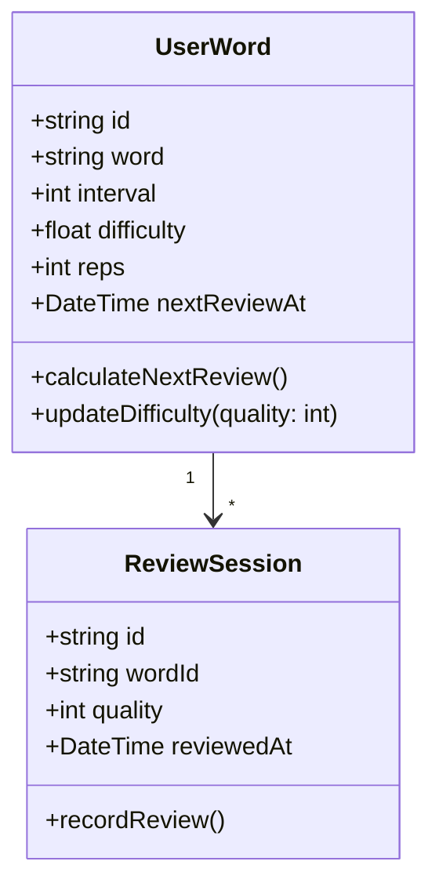
```mermaid
classDiagram
    class UserWord {
        +string id
        +string word
        +int interval
        +float difficulty
        +int reps
        +DateTime nextReviewAt
        +calculateNextReview()
        +updateDifficulty(quality: int)
    }
    
    class ReviewSession {
        +string id
        +string wordId
        +int quality
        +DateTime reviewedAt
        +recordReview()
    }
    
    UserWord "1" --> "*" ReviewSession
```

---

## 三、AI 服务集成设计

### 3.1 AI 服务架构

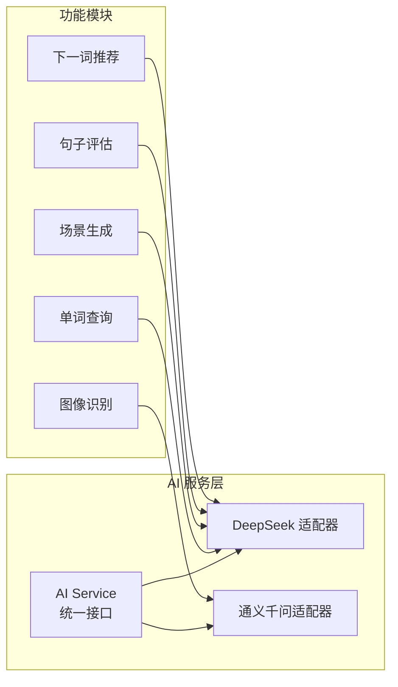
```mermaid
graph LR
    subgraph "AI 服务层"
        AIService["AI Service<br/>统一接口"]
        DeepSeekAdapter["DeepSeek 适配器"]
        QwenAdapter["通义千问适配器"]
    end
    
    subgraph "功能模块"
        WordLookup["单词查询"]
        SceneGen["场景生成"]
        SentenceEval["句子评估"]
        NextToken["下一词推荐"]
        OCR["图像识别"]
    end
    
    AIService --> DeepSeekAdapter
    AIService --> QwenAdapter
    
    WordLookup --> DeepSeekAdapter
    SceneGen --> DeepSeekAdapter
    SentenceEval --> DeepSeekAdapter
    NextToken --> DeepSeekAdapter
    OCR --> QwenAdapter
```

### 3.2 Prompt 模板设计

基于 `0005-new-design.md` 的 Prompt 模板原则：

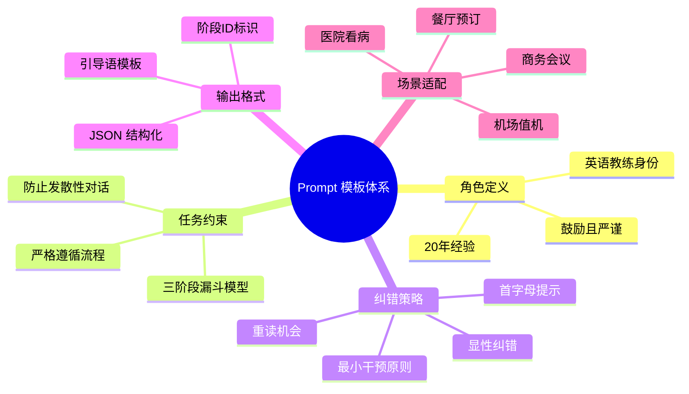
```mermaid
mindmap
    root((Prompt 模板体系))
        角色定义
            英语教练身份
            20年经验
            鼓励且严谨
        任务约束
            三阶段漏斗模型
            防止发散性对话
            严格遵循流程
        纠错策略
            最小干预原则
            首字母提示
            显性纠错
            重读机会
        输出格式
            JSON 结构化
            阶段ID标识
            引导语模板
        场景适配
            机场值机
            餐厅预订
            医院看病
            商务会议
```

### 3.3 语义相似度验证

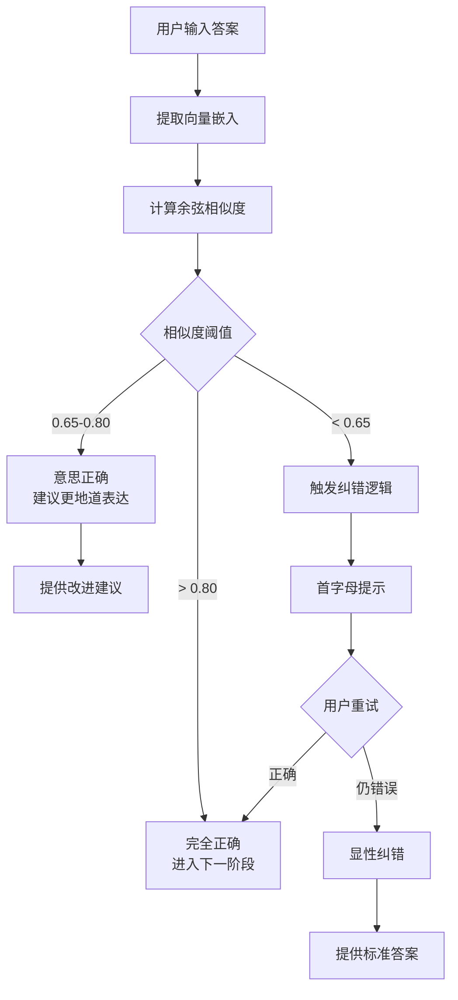
```mermaid
flowchart TD
    A["用户输入答案"] --> B["提取向量嵌入"]
    B --> C["计算余弦相似度"]
    
    C --> D{相似度阈值}
    D -->|> 0.80| E["完全正确<br/>进入下一阶段"]
    D -->|0.65-0.80| F["意思正确<br/>建议更地道表达"]
    D -->|< 0.65| G["触发纠错逻辑"]
    
    F --> H["提供改进建议"]
    G --> I["首字母提示"]
    I --> J{用户重试}
    J -->|正确| E
    J -->|仍错误| K["显性纠错"]
    K --> L["提供标准答案"]
```

---

## 四、前端组件架构

### 4.1 页面路由结构

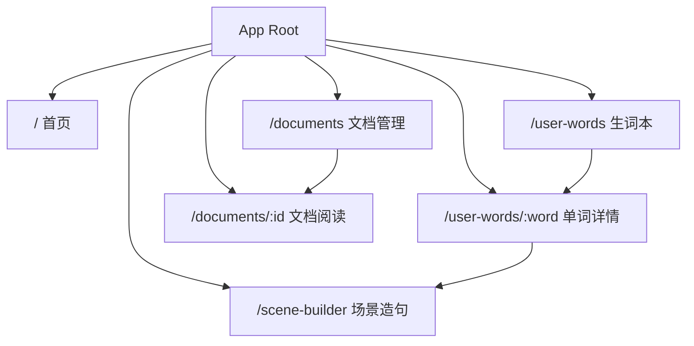
```mermaid
graph TD
    App["App Root"]
    
    App --> Home["/ 首页"]
    App --> Words["/user-words 生词本"]
    App --> WordDetail["/user-words/:word 单词详情"]
    App --> SceneBuilder["/scene-builder 场景造句"]
    App --> Documents["/documents 文档管理"]
    App --> DocView["/documents/:id 文档阅读"]
    
    Words --> WordDetail
    WordDetail --> SceneBuilder
    Documents --> DocView
```

### 4.2 场景造句组件层次

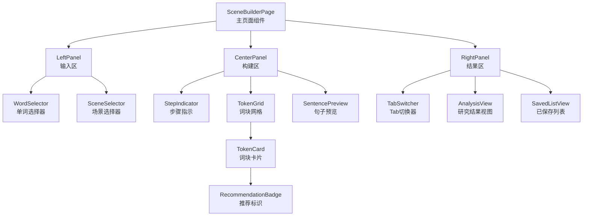
```mermaid
graph TB
    SceneBuilderPage["SceneBuilderPage<br/>主页面组件"]
    
    SceneBuilderPage --> LeftPanel["LeftPanel<br/>输入区"]
    SceneBuilderPage --> CenterPanel["CenterPanel<br/>构建区"]
    SceneBuilderPage --> RightPanel["RightPanel<br/>结果区"]
    
    LeftPanel --> WordSelector["WordSelector<br/>单词选择器"]
    LeftPanel --> SceneSelector["SceneSelector<br/>场景选择器"]
    
    CenterPanel --> StepIndicator["StepIndicator<br/>步骤指示"]
    CenterPanel --> TokenGrid["TokenGrid<br/>词块网格"]
    CenterPanel --> SentencePreview["SentencePreview<br/>句子预览"]
    
    RightPanel --> TabSwitcher["TabSwitcher<br/>Tab切换器"]
    RightPanel --> AnalysisView["AnalysisView<br/>研究结果视图"]
    RightPanel --> SavedListView["SavedListView<br/>已保存列表"]
    
    TokenGrid --> TokenCard["TokenCard<br/>词块卡片"]
    TokenCard --> RecommendationBadge["RecommendationBadge<br/>推荐标识"]
```

### 4.3 状态管理流程

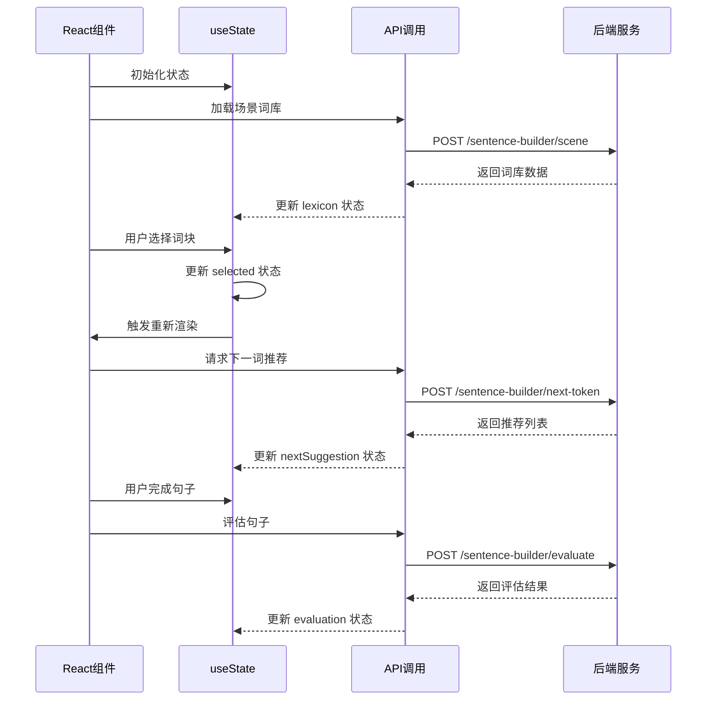
```mermaid
sequenceDiagram
    participant Component as React组件
    participant State as useState
    participant API as API调用
    participant Backend as 后端服务
    
    Component->>State: 初始化状态
    Component->>API: 加载场景词库
    API->>Backend: POST /sentence-builder/scene
    Backend-->>API: 返回词库数据
    API-->>State: 更新 lexicon 状态
    
    Component->>State: 用户选择词块
    State->>State: 更新 selected 状态
    State->>Component: 触发重新渲染
    
    Component->>API: 请求下一词推荐
    API->>Backend: POST /sentence-builder/next-token
    Backend-->>API: 返回推荐列表
    API-->>State: 更新 nextSuggestion 状态
    
    Component->>State: 用户完成句子
    Component->>API: 评估句子
    API->>Backend: POST /sentence-builder/evaluate
    Backend-->>API: 返回评估结果
    API-->>State: 更新 evaluation 状态
```

---

## 五、数据模型详细设计

### 5.1 完整 ER 图

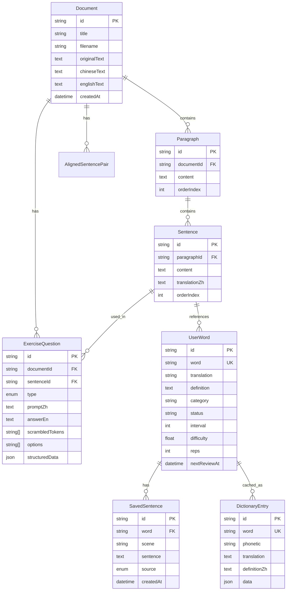
```mermaid
erDiagram
    Document ||--o{ Paragraph : contains
    Document ||--o{ AlignedSentencePair : has
    Document ||--o{ ExerciseQuestion : has
    
    Paragraph ||--o{ Sentence : contains
    Sentence ||--o{ UserWord : references
    Sentence ||--o{ ExerciseQuestion : used_in
    
    UserWord ||--o{ SavedSentence : has
    UserWord ||--o{ DictionaryEntry : cached_as
    
    Document {
        string id PK
        string title
        string filename
        text originalText
        text chineseText
        text englishText
        datetime createdAt
    }
    
    Paragraph {
        string id PK
        string documentId FK
        text content
        int orderIndex
    }
    
    Sentence {
        string id PK
        string paragraphId FK
        text content
        text translationZh
        int orderIndex
    }
    
    UserWord {
        string id PK
        string word UK
        string translation
        text definition
        string category
        string status
        int interval
        float difficulty
        int reps
        datetime nextReviewAt
    }
    
    SavedSentence {
        string id PK
        string word FK
        string scene
        text sentence
        enum source
        datetime createdAt
    }
    
    DictionaryEntry {
        string id PK
        string word UK
        string phonetic
        text translation
        text definitionZh
        json data
    }
    
    ExerciseQuestion {
        string id PK
        string documentId FK
        string sentenceId FK
        enum type
        text promptZh
        text answerEn
        string[] scrambledTokens
        string[] options
        json structuredData
    }
```

### 5.2 数据库索引策略

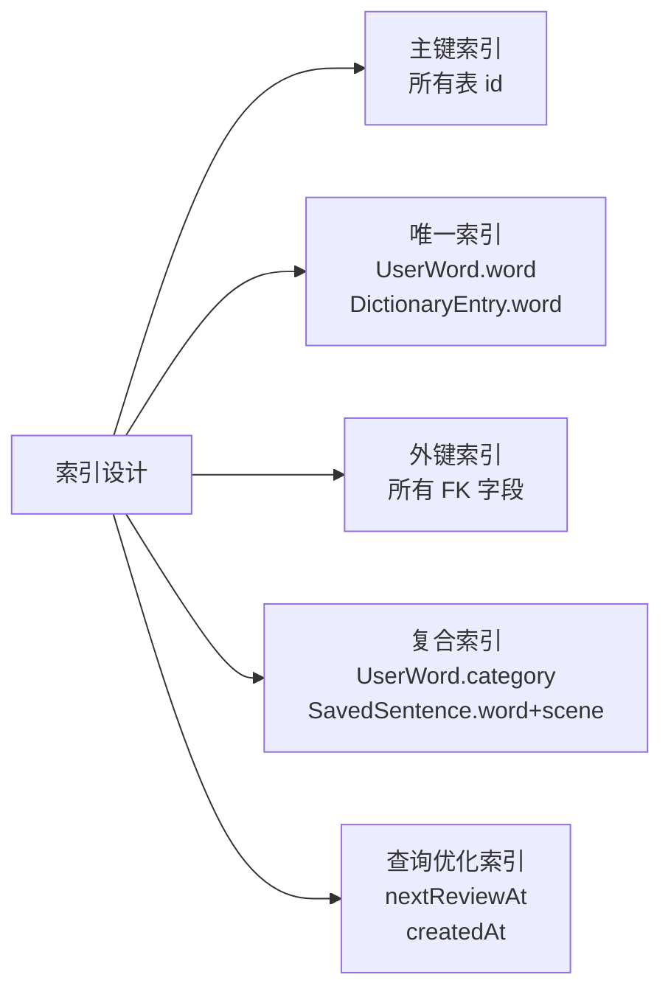
```mermaid
graph LR
    A["索引设计"] --> B["主键索引<br/>所有表 id"]
    A --> C["唯一索引<br/>UserWord.word<br/>DictionaryEntry.word"]
    A --> D["外键索引<br/>所有 FK 字段"]
    A --> E["复合索引<br/>UserWord.category<br/>SavedSentence.word+scene"]
    A --> F["查询优化索引<br/>nextReviewAt<br/>createdAt"]
```

---

## 六、API 接口设计

### 6.1 RESTful API 端点

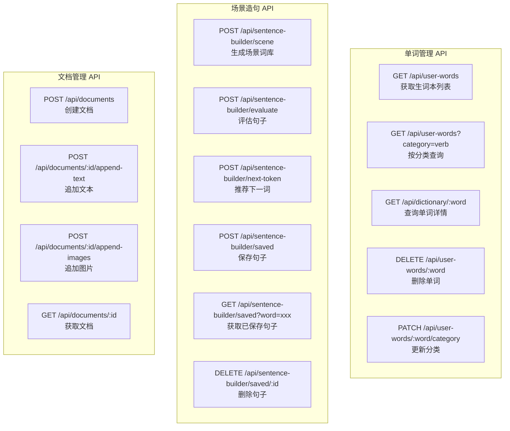
```mermaid
graph TB
    subgraph "单词管理 API"
        GET1["GET /api/user-words<br/>获取生词本列表"]
        GET2["GET /api/user-words?category=verb<br/>按分类查询"]
        GET3["GET /api/dictionary/:word<br/>查询单词详情"]
        DELETE1["DELETE /api/user-words/:word<br/>删除单词"]
        PATCH1["PATCH /api/user-words/:word/category<br/>更新分类"]
    end
    
    subgraph "场景造句 API"
        POST1["POST /api/sentence-builder/scene<br/>生成场景词库"]
        POST2["POST /api/sentence-builder/evaluate<br/>评估句子"]
        POST3["POST /api/sentence-builder/next-token<br/>推荐下一词"]
        POST4["POST /api/sentence-builder/saved<br/>保存句子"]
        GET4["GET /api/sentence-builder/saved?word=xxx<br/>获取已保存句子"]
        DELETE2["DELETE /api/sentence-builder/saved/:id<br/>删除句子"]
    end
    
    subgraph "文档管理 API"
        POST5["POST /api/documents<br/>创建文档"]
        POST6["POST /api/documents/:id/append-text<br/>追加文本"]
        POST7["POST /api/documents/:id/append-images<br/>追加图片"]
        GET5["GET /api/documents/:id<br/>获取文档"]
    end
```

### 6.2 API 请求/响应示例

**生成场景词库**
```json
POST /api/sentence-builder/scene
Request: {
  "scene": "机场值机",
  "level": "intermediate",
  "word": "reservation"
}
Response: {
  "scene": "机场值机",
  "requiredWord": "reservation",
  "subjects": [
    { "id": "s1", "text": "I" },
    { "id": "s2", "text": "We" }
  ],
  "verbs": [
    { "id": "v1", "text": "would like to make" },
    { "id": "v2", "text": "need to confirm" }
  ],
  "objects": [
    { "id": "o1", "text": "a reservation" },
    { "id": "o2", "text": "my reservation" }
  ],
  "modifiers": [
    { "id": "m1", "text": "please" },
    { "id": "m2", "text": "for tomorrow" }
  ],
  "corePhrases": [
    { "id": "cp1", "text": "make a reservation" }
  ],
  "suggestedSentences": [
    "I would like to make a reservation, please."
  ]
}
```

---

## 七、部署架构

### 7.1 生产环境部署拓扑

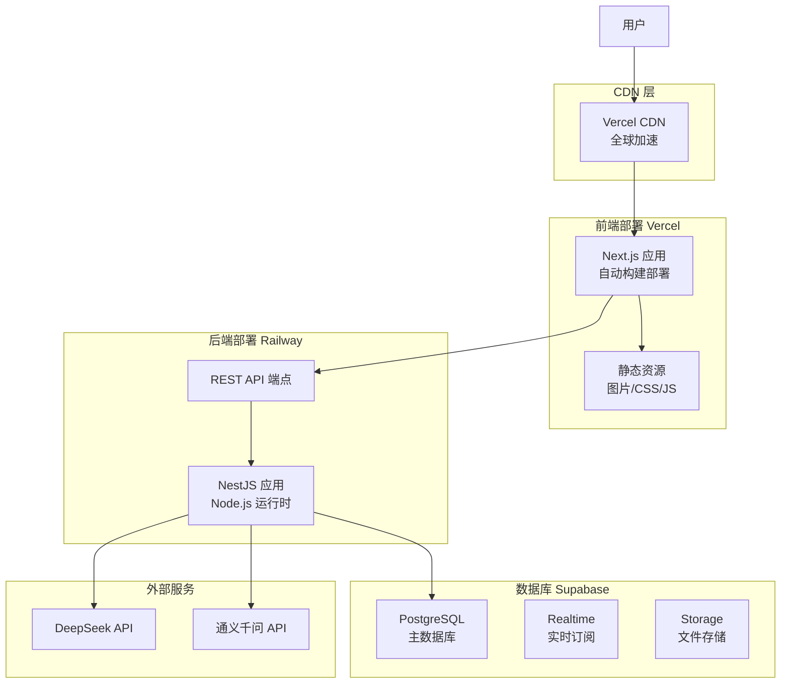
```mermaid
graph TB
    subgraph "CDN 层"
        VercelCDN["Vercel CDN<br/>全球加速"]
    end
    
    subgraph "前端部署 Vercel"
        NextJS["Next.js 应用<br/>自动构建部署"]
        StaticAssets["静态资源<br/>图片/CSS/JS"]
    end
    
    subgraph "后端部署 Railway"
        NestJSApp["NestJS 应用<br/>Node.js 运行时"]
        APIEndpoints["REST API 端点"]
    end
    
    subgraph "数据库 Supabase"
        PostgreSQL["PostgreSQL<br/>主数据库"]
        Realtime["Realtime<br/>实时订阅"]
        Storage["Storage<br/>文件存储"]
    end
    
    subgraph "外部服务"
        DeepSeekAPI["DeepSeek API"]
        QwenAPI["通义千问 API"]
    end
    
    User["用户"] --> VercelCDN
    VercelCDN --> NextJS
    NextJS --> APIEndpoints
    APIEndpoints --> NestJSApp
    NestJSApp --> PostgreSQL
    NestJSApp --> DeepSeekAPI
    NestJSApp --> QwenAPI
    NextJS --> StaticAssets
```

### 7.2 CI/CD 流程

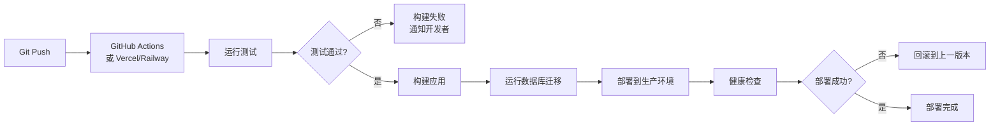
```mermaid
flowchart LR
    A["Git Push"] --> B["GitHub Actions<br/>或 Vercel/Railway"]
    B --> C["运行测试"]
    C --> D{测试通过?}
    D -->|否| E["构建失败<br/>通知开发者"]
    D -->|是| F["构建应用"]
    F --> G["运行数据库迁移"]
    G --> H["部署到生产环境"]
    H --> I["健康检查"]
    I --> J{部署成功?}
    J -->|否| K["回滚到上一版本"]
    J -->|是| L["部署完成"]
```

---

## 八、性能优化策略

### 8.1 缓存策略

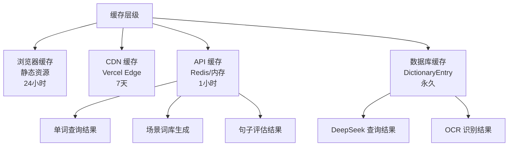
```mermaid
graph TB
    A["缓存层级"] --> B["浏览器缓存<br/>静态资源<br/>24小时"]
    A --> C["CDN 缓存<br/>Vercel Edge<br/>7天"]
    A --> D["API 缓存<br/>Redis/内存<br/>1小时"]
    A --> E["数据库缓存<br/>DictionaryEntry<br/>永久"]
    
    D --> D1["单词查询结果"]
    D --> D2["场景词库生成"]
    D --> D3["句子评估结果"]
    
    E --> E1["DeepSeek 查询结果"]
    E --> E2["OCR 识别结果"]
```

### 8.2 查询优化

```mermaid
flowchart TD
    A["数据库查询"] --> B{查询类型}
    B -->|单条查询| C["使用主键/唯一索引"]
    B -->|范围查询| D["使用复合索引"]
    B -->|关联查询| E["使用 JOIN + 索引"]
    
    C --> F["查询时间 < 10ms"]
    D --> G["查询时间 < 50ms"]
    E --> H["查询时间 < 100ms"]
    
    F --> I["返回结果"]
    G --> I
    H --> I
```

---

## 九、安全设计

### 9.1 安全架构

```mermaid
graph TB
    A["安全防护层"] --> B["HTTPS 加密传输"]
    A --> C["JWT 身份认证"]
    A --> D["API 速率限制"]
    A --> E["输入验证与清理"]
    A --> F["SQL 注入防护<br/>Prisma ORM"]
    A --> G["XSS 防护<br/>React 自动转义"]
    A --> H["CORS 跨域控制"]
    
    B --> I["所有 API 请求"]
    C --> J["需要认证的端点"]
    D --> K["防止 API 滥用"]
    E --> L["用户输入数据"]
    F --> M["数据库查询"]
    G --> N["前端渲染"]
    H --> O["跨域请求"]
```

### 9.2 数据保护

```mermaid
mindmap
    root((数据安全))
        传输加密
            HTTPS/TLS
            WebSocket WSS
        存储加密
            密码哈希 bcrypt
            敏感字段加密
        访问控制
            JWT Token
            角色权限
            Row Level Security
        数据备份
            每日自动备份
            版本控制
            灾难恢复
```

---

## 十、未来扩展规划

### 10.1 功能路线图

```mermaid
gantt
    title 功能开发路线图
    dateFormat YYYY-MM-DD
    section 核心功能
    单词管理           :done, 2024-01-01, 2024-02-01
    场景造句           :done, 2024-02-01, 2024-03-01
    文档处理           :done, 2024-03-01, 2024-04-01
    section 高级功能
    语音识别           :active, 2024-04-01, 2024-05-01
    发音评估           :2024-05-01, 2024-06-01
    移动端适配         :2024-06-01, 2024-07-01
    section 优化功能
    学习统计           :2024-07-01, 2024-08-01
    社交分享           :2024-08-01, 2024-09-01
    多语言支持         :2024-09-01, 2024-10-01
```

### 10.2 架构演进方向

```mermaid
graph LR
    A["当前架构<br/>单体应用"] --> B["微服务架构<br/>服务拆分"]
    B --> C["容器化部署<br/>Docker/K8s"]
    C --> D["服务网格<br/>Istio"]
    D --> E["云原生<br/>Serverless"]
    
    A --> A1["Next.js + NestJS"]
    B --> B1["单词服务<br/>场景服务<br/>文档服务"]
    C --> C1["独立部署<br/>弹性扩展"]
    D --> D1["服务发现<br/>负载均衡"]
    E --> E1["按需计费<br/>自动扩展"]
```

---

## 十一、监控与运维

### 11.1 监控指标

```mermaid
graph TB
    A["系统监控"] --> B["性能指标"]
    A --> C["错误监控"]
    A --> D["业务指标"]
    
    B --> B1["API 响应时间<br/>目标 < 200ms"]
    B --> B2["数据库查询时间<br/>目标 < 100ms"]
    B --> B3["AI API 调用时间<br/>目标 < 2s"]
    
    C --> C1["错误率<br/>目标 < 0.1%"]
    C --> C2["异常日志<br/>实时告警"]
    
    D --> D1["用户活跃度"]
    D --> D2["学习进度统计"]
    D --> D3["功能使用率"]
```

### 11.2 日志管理

```mermaid
flowchart TD
    A["应用日志"] --> B["日志级别"]
    B --> C["ERROR<br/>系统错误"]
    B --> D["WARN<br/>性能警告"]
    B --> E["INFO<br/>业务事件"]
    B --> F["DEBUG<br/>开发调试"]
    
    C --> G["实时告警<br/>邮件/短信"]
    D --> H["监控面板<br/>Grafana"]
    E --> I["日志存储<br/>Supabase Logs"]
    F --> J["本地开发<br/>控制台输出"]
```

---

## 十二、参考资源

### 12.1 技术文档

- [Next.js 官方文档](https://nextjs.org/docs) - Next.js 16 最新特性
- [NestJS 官方文档](https://docs.nestjs.com/) - NestJS 11 最佳实践
- [Prisma 官方文档](https://www.prisma.io/docs) - ORM 使用指南
- [Supabase 官方文档](https://supabase.com/docs) - 数据库和认证
- [DeepSeek API 文档](https://platform.deepseek.com/api-docs) - AI 服务集成
- [Mermaid 图表语法](https://mermaid.js.org/syntax/) - 图表绘制参考

### 12.2 理论研究

- **脚手架学习理论** (Wood, Bruner, Ross, 1976)
- **近侧发展区间** (Vygotsky, 1978)
- **间隔重复系统** (Ebbinghaus, 1885)
- **主动召回效应** (Roediger & Karpicke, 2006)

---

## 附录：关键代码示例

### A.1 状态机实现（伪代码）

```typescript
// 基于 XState 的状态机实现
import { createMachine } from 'xstate';

const learningMachine = createMachine({
  id: 'learning',
  initial: 'IDLE',
  states: {
    IDLE: {
      on: { START: 'CONTEXT_SETTING' }
    },
    CONTEXT_SETTING: {
      on: { 
        CONTEXT_READY: 'GAP_FILLING',
        CANCEL: 'IDLE'
      }
    },
    GAP_FILLING: {
      on: {
        CORRECT: 'NATURAL_FLOW',
        INCORRECT: 'CORRECTING'
      }
    },
    CORRECTING: {
      on: {
        RETRY: 'GAP_FILLING',
        GIVE_UP: 'IDLE'
      }
    },
    NATURAL_FLOW: {
      on: {
        COMPLETE: 'IDLE',
        CONTINUE: 'CONTEXT_SETTING'
      }
    }
  }
});
```

### A.2 语义相似度计算

```typescript
// 使用 OpenAI Embeddings API 计算余弦相似度
async function calculateSimilarity(
  userAnswer: string,
  referenceAnswer: string
): Promise<number> {
  const [userEmbedding, refEmbedding] = await Promise.all([
    getEmbedding(userAnswer),
    getEmbedding(referenceAnswer)
  ]);
  
  const dotProduct = userEmbedding.reduce(
    (sum, val, i) => sum + val * refEmbedding[i], 0
  );
  const magnitude = (vec: number[]) =>
    Math.sqrt(vec.reduce((sum, val) => sum + val * val, 0));
  
  return dotProduct / (magnitude(userEmbedding) * magnitude(refEmbedding));
}
```

---

**文档版本：** v0.6  
**最后更新：** 2024年  
**维护者：** 开发团队  
**基于文档：** `0005-new-design.md`

